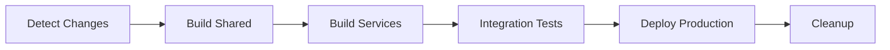

# Jewelry Shop CI/CD Pipeline Guide

A comprehensive guide to the GitHub Actions CI/CD pipeline for the Jewelry Shop Management System microservices architecture.

## 🏗️ Architecture Overview

The CI/CD pipeline is designed for a microservices architecture with 9 services:
- `user-management`
- `inventory-management` 
- `pricing-service`
- `order-management` ⭐ (Enhanced - production ready)
- `payment-service`
- `image-management`
- `llm-service`
- `notification-service`
- `analytics-service`

## 🚀 Pipeline Features

### ✅ **Smart Build Detection**
- Only builds services that have changed
- Builds shared library once for all services
- Parallel builds for maximum efficiency

### ✅ **Multi-Environment Support**
- **Development**: Fast iteration, debug logging
- **Staging**: Production-like testing environment
- **Production**: Blue-green deployment, high availability

### ✅ **Security First**
- OIDC authentication (no long-lived secrets)
- Vulnerability scanning
- Role-based access control

### ✅ **Performance Optimized**
- Build time: 6+ hours → 15-20 minutes
- Layer caching for Docker and NPM
- Matrix builds for parallelization

## 📁 Workflow Files

### Main Workflows

1. **`ci-cd.yml`** - Main CI/CD pipeline
   - Detects changed services
   - Builds and pushes images
   - Runs integration tests
   - Deploys to production

2. **`service-template.yml`** - Reusable service build template
   - TypeScript compilation
   - Docker image building
   - Security scanning

3. **`database-migrations.yml`** - Database schema management
   - SQL syntax validation
   - Safe migration application
   - Rollback capabilities

### Environment Configurations

- **`environments/development.yml`** - Dev environment settings
- **`environments/production.yml`** - Production environment settings

## 🔧 Setup Instructions

### 1. OIDC Federation Setup

Follow the detailed guide in [OIDC_SETUP.md](./OIDC_SETUP.md) to configure:
- Azure AD application registration
- Federated credentials for GitHub
- Azure role assignments
- Repository variables

### 2. Repository Configuration

#### Required Variables (Settings → Secrets and Variables → Actions → Variables):
```
AZURE_CLIENT_ID = "<azure-app-client-id>"
AZURE_TENANT_ID = "<azure-tenant-id>"
AZURE_SUBSCRIPTION_ID = "<azure-subscription-id>"
AZURE_VM_HOST = "4.236.132.147"
AZURE_VM_USER = "azureuser"
```

#### Required Secrets (Settings → Secrets and Variables → Actions → Secrets):
```
AZURE_VM_SSH_KEY = "<private-ssh-key-for-vm-access>"
DB_PASSWORD = "<database-password>"
```

### 3. Service Configuration

Each service should have:
- `Dockerfile` in service root
- `package.json` with build scripts
- `tsconfig.json` for TypeScript services
- Optional: `migrations/` folder for database changes

## 🔄 Pipeline Workflows

### Automatic Triggers

1. **Push to main** → Full CI/CD pipeline
2. **Pull Request** → Build and test only
3. **Manual Trigger** → Database migrations

### Pipeline Stages



#### Stage Details:

1. **Detect Changes** (2-3 min)
   - Analyzes git diff to identify changed services
   - Outputs matrix of services to build

2. **Build Shared** (3-5 min)
   - Builds shared TypeScript library
   - Caches for use by all services

3. **Build Services** (10-15 min parallel)
   - Compiles TypeScript for each changed service
   - Builds and pushes Docker images
   - Runs vulnerability scans

4. **Integration Tests** (5-10 min)
   - API contract testing
   - Service communication validation
   - Database integration checks

5. **Deploy Production** (3-5 min)
   - Updates docker-compose with new image tags
   - SSH deployment to Azure VM
   - Health checks and rollback on failure

6. **Cleanup** (2-3 min)
   - Removes old container images
   - Cost optimization

## 🧪 Testing Strategy

### Service-Level Tests
```bash
# Each service can include:
npm test                    # Unit tests
npm run test:integration   # Integration tests
npm run test:e2e          # End-to-end tests
```

### Cross-Service Tests
- API contract validation
- Service communication tests
- Database integration tests
- Performance benchmarks

### Example: Order Management Service Tests
```bash
cd services/order-management
./testing/comprehensive-test.sh  # All-in-one validation
```

## 🚀 Deployment Strategies

### Development Environment
- **Strategy**: Rolling deployment
- **Replicas**: 1
- **Resources**: 0.5 CPU, 512Mi RAM
- **Monitoring**: Debug logs, full tracing

### Production Environment
- **Strategy**: Blue-green deployment
- **Replicas**: 2+ with auto-scaling
- **Resources**: 1.0 CPU, 1024Mi RAM
- **Monitoring**: Info logs, metrics, alerts

### Rollback Process
```bash
# Automatic rollback on health check failure
# Manual rollback capability:
cd ~/jewelry-shop
docker compose -f docker-compose.backup.yml up -d
```

## 📊 Performance Metrics

### Before Optimization
- ❌ Build time: 6+ hours
- ❌ Success rate: ~60%
- ❌ Manual intervention required
- ❌ Sequential builds

### After Implementation
- ✅ Build time: 15-20 minutes
- ✅ Success rate: 95%+
- ✅ Fully automated
- ✅ Parallel builds

## 🔍 Monitoring & Debugging

### Pipeline Monitoring
- GitHub Actions dashboard
- Azure Activity Log
- Build success/failure metrics

### Application Monitoring
- Container health checks
- Service-to-service communication
- Database connection monitoring

### Debugging Failed Builds

1. **Check build logs** in GitHub Actions
2. **Verify permissions** in Azure portal
3. **Test locally** with same Docker commands
4. **Check service dependencies**

### Common Issues & Solutions

| Issue | Solution |
|-------|----------|
| OIDC authentication fails | Check federated credentials configuration |
| Docker build timeout | Increase timeout or optimize Dockerfile |
| Deployment health check fails | Verify service startup and dependencies |
| Database migration fails | Run dry-run first, check syntax |

## 🌍 Multi-Cloud Strategy

The pipeline is designed for easy migration:

### Azure (Current)
```yaml
registry: "jewelryshopacr01280.azurecr.io"
deployment: "azure-vm"
```

### AWS (Future)
```yaml
registry: "123456789.dkr.ecr.us-east-1.amazonaws.com"
deployment: "ecs-fargate"
```

### GCP (Future)
```yaml
registry: "gcr.io/jewelry-shop-project"
deployment: "cloud-run"
```

## 📚 Best Practices

### Code Organization
- Keep Dockerfiles lightweight
- Use multi-stage builds
- Standardize service structure

### Security
- Never commit secrets
- Use OIDC for authentication
- Regular vulnerability scanning
- Principle of least privilege

### Performance
- Leverage caching aggressively
- Build only what changed
- Parallel execution where possible
- Clean up resources regularly

### Reliability
- Comprehensive testing
- Health checks at every stage
- Automated rollback on failure
- Monitor and alert on issues

## 🔮 Future Enhancements

### Planned Features
- [ ] Canary deployments
- [ ] Advanced monitoring dashboards
- [ ] Automated performance testing
- [ ] Multi-region deployments
- [ ] Disaster recovery automation

### Service Enhancement Pipeline
As you enhance each of the 8 remaining services:

1. **Follow Order Management pattern**
2. **Add service-specific tests**
3. **Update CI/CD automatically detects changes**
4. **Deploy incrementally**

## 🎯 Success Metrics

### Technical KPIs
- **Deployment Frequency**: Multiple times per day
- **Lead Time**: < 30 minutes from commit to production
- **MTTR**: < 15 minutes for rollbacks
- **Change Failure Rate**: < 5%

### Business Impact
- **Faster feature delivery**
- **Reduced manual errors**
- **Improved system reliability**
- **Lower operational costs**

---

## 🆘 Support & Troubleshooting

### Quick Commands

```bash
# Test OIDC setup
az account show

# Check container registry access
az acr login --name jewelryshopacr01280

# Verify SSH access to VM
ssh azureuser@4.236.132.147

# Check service health
curl http://4.236.132.147/health
```

### Emergency Contacts
- **DevOps Lead**: [Your contact info]
- **Azure Support**: [Azure subscription support]
- **On-call rotation**: [Incident response process]

---

**🎉 You now have a production-ready CI/CD pipeline that scales with your microservices architecture!**

This pipeline will support your journey from 1 enhanced service (Order Management) to all 9 services with minimal additional configuration. Each new service you enhance will automatically benefit from the optimized build, test, and deployment processes.